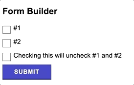
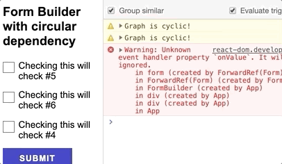

# Form Builder
Form Builder takes in an **input JSON** (in `components/FormBuilder/states.json`, constructs an adjacency list representing an **unweighted and directed graph** (every node is a component and every edge is a dependency), and outputs a **Form JSX**.

## Setup
1. `npm install`
2. `npm run dev`

## Other Features
Circular Form  

Exaggerated Form  

