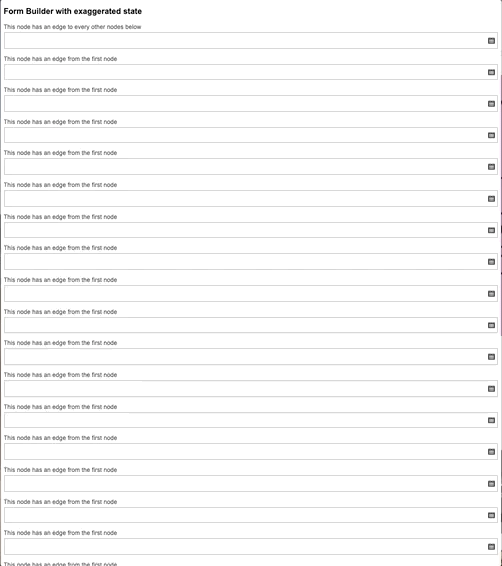

<h1 align="center"> Form Builder </h1>

  

## The Opportunity

AXA's insurance ecommerce products are a sequence of form components, and each component is manually configured.  
Can we automate this process, and cut down development time for ecommerce products?

## The Solution

Form Builder takes in an **input JSON** and outputs a **dynamic Form JSX**.  
Internally,  Form Builder builds a **dependency graph**, wherein every **node is a component** and every **edge specifies the node's callbacks**; user interaction on a node will trigger its associated callbacks.

## Setup

1. `npm install`
2. `npm run dev`

## Integration with AXA internal component library

## Credits

[Shawn Lim](https://github.com/geekyme/demo-react-hooks), for his graph POC  
[Zhi Yue](https://github.com/ZhiyueYi), for pair programming with me
